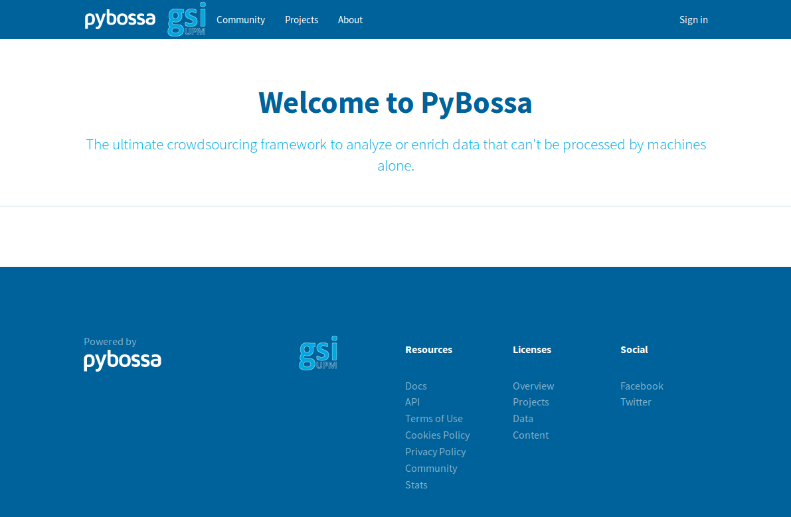

Creating a project
------------------

Once you have installed the Pybossa server in your computer, go to http://localhost:8080/ in your browser. There you can see the next webpage:

The first step for creating projects is creating a Pybossa account. To do so, click the 
Sign in button of the navigation bar and register a new account or access to Pybossa via Twitter or Google.

The first account registered in the Pybossa environment is set as administrator account.
If you are not an administrator and you want to create a project, ask the administrator to change your role.

If you are administrator and want to change the role of a user, clic your account name on the navigation bar and go to Admin site > Administrators, search the account name of the user whose role will be changed and change it.

If you want to let everyone create a project, go to the directory gsi-template of the directory cloned in the installation phase and delete in the files _navbar.html and projects.html the lines that include if current_user.admin == 1 and its corresponding endif.
In the file _helpers.html move the My projects element out of the if current_user.admin.

Preparing the project in a local directory
==========================================

Once you have registered in Pybossa, go to the local directory where your project is located. In our tutorial, this directory is called projectexample.

In this directory, there is everything you need to create a new project.

In the file project.json, you have to put the name, short_name and description of your project. You cannot have two projects with the same short_name in the same server.

In the csv folder, you have to include the json or csv that you want to import to Pybossa. If you want to use our templates you need the word Tweet as index of a column of the csv file and if you want to generate our report, you also need id_str as another index.

In this folder, you also have to include a file Golden.csv with at least one golden question.

The template.html file is the one that is shown to the contributors where tasks are presented. You can modify it if you want and adapting it to your csv.
The template.html included in project example is our template for sentiments and the template2.html is our template for emotions, if you want to use this one, you have to rename template2.html to template.html.
The templateextra.html is an example of how to get pictures from the volume called extra, if you want to use you have to add the files that you want to add to the container to your extra folder, adapt the templateextra.html to your project and renaming templateextra.html to template.html .

The report.py script has functions for preparing the data for being inserted to pybossa and generating a report.

If you want to prepare your json data for being inserted to pybossa execute in your projectexample folder:

.. code-block:: bash

	python report.py json jsonfile

Where jsonfile is the name of your json (located in the csv folder).

If you want to prepare your csv data for being inserted to pybossa execute:

.. code-block:: bash

	python report.py csv csvfile

Where csvfile is the name of your json (located in the csv folder).

Creating the project in the Pybossa server
==========================================

Once you have your project ready, execute the following commands on a shell on the local directory where your project is placed.

.. code-block:: bash

	pbs --server yourserver --api-key yourapikey create_project
	pbs --server yourserver --api-key yourapikey add_tasks --tasks-file csvfile.csv
	pbs --server yourserver --api-key yourapikey update_project

Where yourserver is the name of the server where pybossa is running. In this case, with our Docker installation, the server is configured to be http://localhost:8080.
The field yourapikey is found by clicking My Profile in the menu that appear clicking your account name in the navigation bar.
The parameter csvfile.csv is the name of your csv file which includes the tasks, if you have followed the steps of the section above, this file is called tweetsForPybossa.csv .

The projects created can be seen by clicking the Projects button in the navigation bar.