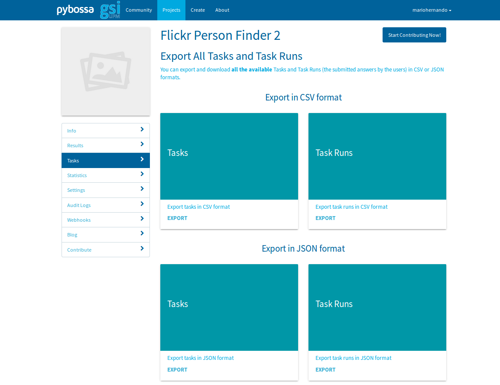

Getting results
---------------

If you are an admin, you can check the answers that have already been answered in a project by selecting the desired project on the My Projects page and going to:

Tasks > Browse

In the following sections it is explained how to download the tasks results and generating a report.

Downloading tasks results
=========================

If you want to download the results, go to your project menu and after:

Tasks > Export Tasks

You are going to see the next webpage:

You can choose whether exporting your tasks in a CSV format or JSON format, after, a zip file is downloaded.

Generating a report
===================

If you want to generate a report including the agreement of the raters in each question and the inter-agreement reached, in the projectexample folder, there is a script called report.py that would generate a report. 
In order to use it, you have to download the results as explained before in JSON format and extract the zips in the csv folder of projectexample. After, the report is generated by writing this comand:

.. code-block:: bash

	python report.py report filewithids numberofcategories

Where filewithids is the name of the file that have the id_str field of each tweet (put this file in the csv folder) and numberofcategories is the number of possible answers; for example, if each task has to be labeled with Positive, Negative or Neutral, you have to substitute numberofcategories with a 3.

In order to have the inter-agreement Fleiss Kappa coefficient, you have to become aware of that in all the questions there have to be the same amount of users that have contributed.

After executing it, in the csv folder of projectexample you will find the files usertweetinfo.csv with the answers of each contributor and their trust score, goldenpercent.csv, with the agreement of each question taking into account the golden trust score of the users and majoritypercent.csv, with the agreement of each question taking into account the majority trust score.

In the shell, you are going to see the Fleiss Kappa coefficient of inter-agreement.