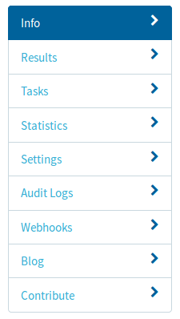

Personalizing projects
----------------------

After creating a project and importing the tasks, there are some configuration
options that can be changed in order to personalize the project.

If you want to change the configuration of the project, first of all, you have to select your project in the Projects page. After selecting the project you will see the next menu:

With this menu, we can configure the following options:

Redundancy
==========
Parameter which indicates the number of task runs that must be obtained for each task.
For configuring the redundancy, you have to go to:

Tasks > Settings > Tasks Redundancy

Password
========
Parameter used for allowing only certain people to contribute to your project.
Establishing a password is done by going to:

Settings > Project details > Protect with a password

Priority
========
It establishes which tasks will be delivered first to the volunteers that will label
the tasks.
Changing this configuration option is done by going to:

Tasks > Settings > Tasks Priority

