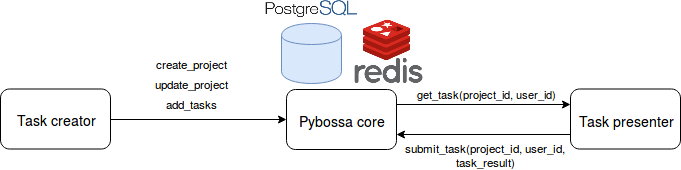

What is Pybossa?
----------------

Pybossa is an open source platform that allows its users create and run projects that include tasks which require human cognition and because of that, they have to be labeled by its contributors.

Architecture
============

The Pybossa architecture is composed by the following components:

* Task creator: the purpose of this component is creating a project and adding tasks to it. You can create a project using the Pybossa webpage or using the command line, the result will be the same. You can also add tasks to the project using Google Drive and other options or using the command line.

* Pybossa core: pybossa uses PostgreSQL for storing the usernames, user roles (admin or not), projects, tasks and tasks results and Redis for caching objects, speed up the site and limiting the usage of the API requests.

* Task presenter: in this component, the task is shown in the interface and once the contributor has labeled it, the result is sent to the Pybossa core.

